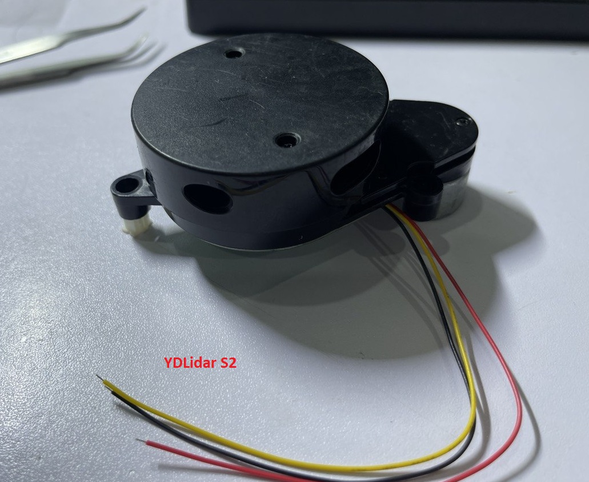
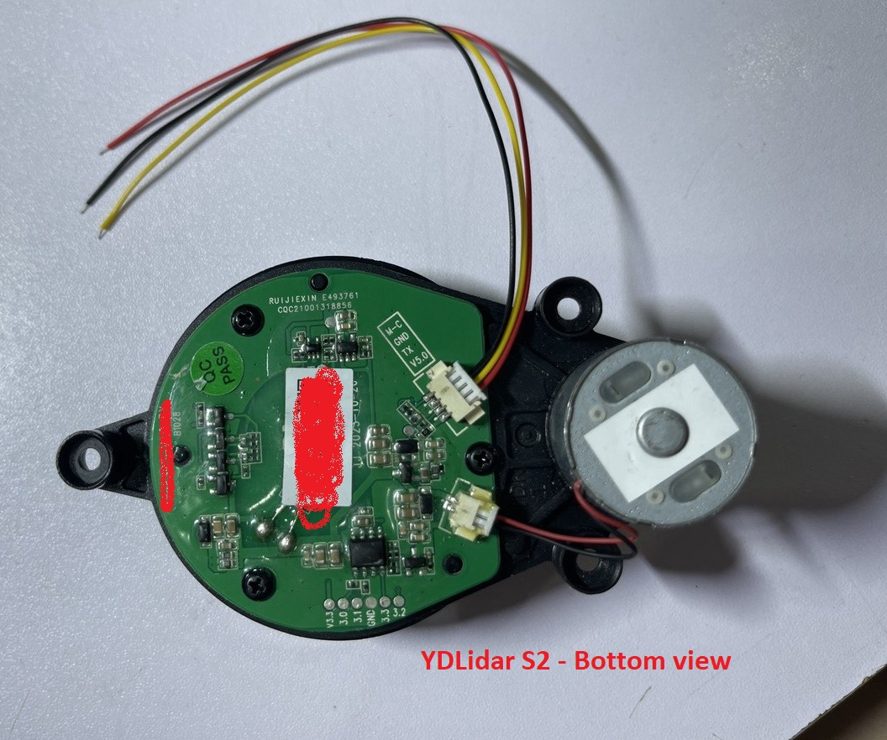
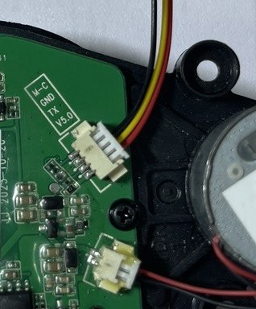
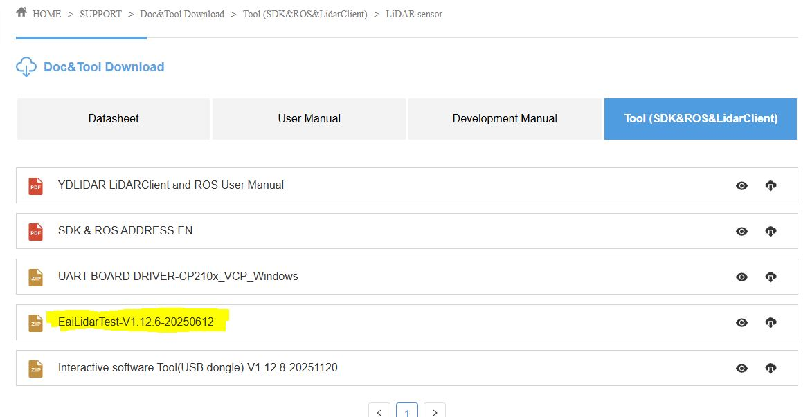
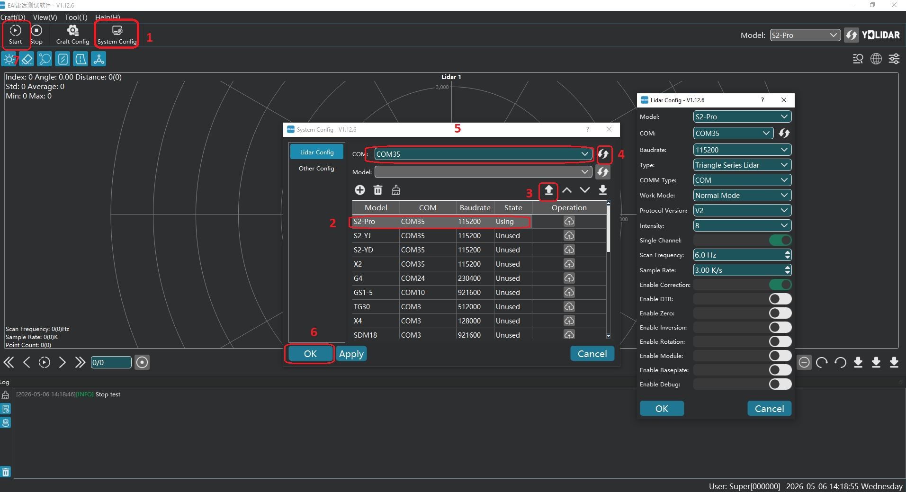
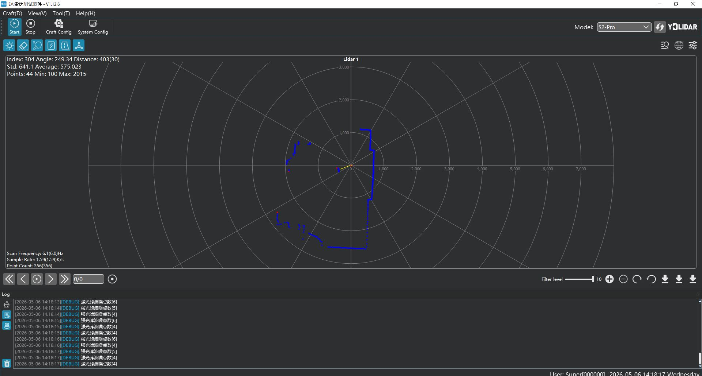

# 1. Hướng dẫn kết nối YDLidar S2 (Mã YDS2xxx )

YDLidar S2 là lidar được trang bị trên các dòng robot hút bụi nội địa của Trung Quốc, vì vậy gần như không có tài liệu official từ YDLidar.

 

Hướng dẫn này hoàn toàn dựa trên thực nghiệm của tác giả, có điều gì thiếu sót, bạn đọc vui lòng góp ý với tác giả qua các kênh hỗ trợ (FB mess, zalo, ...) để hướng dẫn ngày càng hoàn thiện hơn

YDLidar S2 sử dụng connector JST 1.25 4pin để kết nối tới MCU hoặc PC/máy tính nhúng thông qua module chuyển đổi USB-TTL.



Thứ tự các chân tín hiệu trên connector này như sau:

| Pin | Tên           | kết nối với  MCU (STM32/ESP32/Arduino)                                   | Kết nối tới PC/SBC qua Module chuyển đổi USB-TTL
| --- | ------------- | ------------------------------------------------------------------------ | --------------------------- |
| 1   | +5V           | Nối tới nguồn +5V                                                        | +5V của module USB-TTL
| 2   | TX            | Nối tới chân RX của MCU                                                  | RXD của module USB-TTL
| 3   | GND           | Nối tới mass chung (GND)                                                 | GND của module USB-TTL
| 4   | M-C           | Nối tới chân PWM của MCU để điều chỉnh tốc độ quét của module (optional) | không cần, S2 sẽ quay với tần số quét mặc định khoảng 6Hz


Tuy nhiên trong khuôn khổ repo này chỉ đề cập đến việc kết nối YDLidar S2 với PC hoặc máy tính nhúng SBC (như Jetson, Raspberry pi, ...) thông qua module chuyển đổi USB-TTL.
Thư viện Arduino tác giả sẽ bổ sung trong thời gian sớm nhất có thể.

***Chú ý***

*Nên sử dụng module chuyển đổi USB-UART "xịn" như CP2102, FTDI232. Tuy nhiên cũng có thể dùng CH340 giá rẻ và rất phổ biến, ae có thể tìm mua với giá dao động từ 15-40k từ các shop linh kiện điện từ hoặc sàn thương mại điện tử. Trong bài viết này minh họa sử dụng với module FTDI232.*

# 2. Hướng dẫn test nhanh với tool EAILidarTest

EAILidarTest là tool chính chủ của EAI (YDLidar) dùng để xem point cloud và cài đặt 1 số filter hay ho khác.

Trong nội dung khuôn khổ hướng dẫn này chỉ để cập đến việc sử dụng tool này để xem point cloud từ cảm biến YDLidar X2/S2 trả về qua UART.

## 2.1. Tải và cài đặt phần mềm:

Bạn có thể tải trực tiếp phần mềm EAILidarTest trên trang chủ của YDLidar tại:

https://www.ydlidar.com/download/category/lidar-sensor



Hoặc cũng có thể lấy trong thư mục tools của repo này.

## 2.2. Cấu hình và sử dung EAILidarTest

Sau khi tải và giải nén, mở phần mềm EAILidarTest lên và thực hiện cấu hình trên phần mềm như hình minh họa sau:
- Chọn đúng cổng COM của USB-TTL module.
- Chọn đúng model ***S2-Pro*** , các thông số khác để mặc định.





# 3. Sử dụng YDLIDAR ROS2 Driver

ydlidar_ros2_driver là driver chính chủ do YDLidar phát hành, tuy nhiên hiện tại không còn thường xuyên được update nữa. và đã được clone về repo này nhắm mục đích hỗ trợ anh em các vấn đề với ROS2 hiện đại.

## 3.1. Biên dịch & Cài đặt YDLidar SDK

ydlidar_ros2_driver phụ thuộc vào thư viện YDLidar-SDK. Nếu bạn chưa cài đặt thư viện YDLidar-SDK hoặc phiên bản hiện tại đã lỗi thời, bạn phải cài đặt thư viện YDLidar-SDK trước. Nếu bạn đã cài đặt phiên bản mới nhất của YDLidar-SDK, hãy bỏ qua bước này và chuyển sang bước tiếp theo.

1. Tải xuống hoặc clone repository [YDLIDAR/YDLidar-SDK](https://github.com/YDLIDAR/YDLidar-SDK) trên GitHub.
2. Biên dịch và cài đặt YDLidar-SDK trong thư mục ***build*** theo hướng dẫn `README.md` của YDLIDAR/YDLidar-SDK.

## 3.2. Biên dịch ydlidar_ros2_driver

1. Clone nhánh master của ydlidar_ros2_driver từ GitHub (dành cho phiên bản cũ):

   `git clone https://github.com/manhbt/ydlidar_ros2_driver.git ydlidar_ros2_ws/src/ydlidar_ros2_driver`

   Clone nhánh humble của ydlidar_ros2_driver từ GitHub (dành cho humble, jazzy, v.v.):

   `git clone -b humble https://github.com/manhbt/ydlidar_ros2_driver.git ydlidar_ros2_ws/src/ydlidar_ros2_driver`

2. Biên dịch gói ydlidar_ros2_driver:

   ```
   cd ydlidar_ros2_ws
   colcon build --symlink-install
   ```
   Lưu ý: Cách cài đặt colcon, xem [tại đây](https://index.ros.org/doc/ros2/Tutorials/Colcon-Tutorial/#install-colcon)

   

   <font color=Red size=4>>Lưu ý: Nếu xảy ra lỗi như bên dưới, vui lòng cài đặt [YDLIDAR/YDLidar-SDK](https://github.com/YDLIDAR/YDLidar-SDK) trước.</font>

   

3. Thiết lập môi trường cho gói:

   `source ./install/setup.bash`

    Lưu ý: Thêm biến môi trường workspace vĩnh viễn.
    Sẽ rất tiện lợi nếu các biến môi trường ROS2 được tự động thêm vào phiên bash mỗi khi mở shell mới:
    ```
    echo "source ~/ydlidar_ros2_ws/install/setup.bash" >> ~/.bashrc
    source ~/.bashrc
    ```
4. Xác nhận
    Để xác nhận rằng đường dẫn gói đã được thiết lập, hãy dùng lệnh printenv với `grep -i ROS`.
    ```
    printenv | grep -i ROS
    ```
    Bạn sẽ thấy kết quả tương tự như sau:
        `OLDPWD=/home/tony/ydlidar_ros2_ws/install`

5. Tạo Alias cho cổng serial [tùy chọn]
    ```
    chmod 0777 src/ydlidar_ros2_driver/startup/*
    sudo sh src/ydlidar_ros2_driver/startup/initenv.sh
    ```
    Lưu ý: Sau khi hoàn thành thao tác trên, hãy rút và cắm lại thiết bị LiDAR.

## 3.3. Cấu hình LiDAR [File tham số mặc định](params/ydlidar.yaml)

```
ydlidar_ros2_driver_node:
  ros__parameters:
    port: /dev/ttyUSB0
    frame_id: laser_frame
    ignore_array: ""
    baudrate: 230400
    lidar_type: 1
    device_type: 0
    isSingleChannel: false
    intensity: false
    intensity_bit: 0
    sample_rate: 9
    abnormal_check_count: 4
    fixed_resolution: true
    reversion: false
    inverted: false
    auto_reconnect: true
    support_motor_dtr: false
    angle_max: 180.0
    angle_min: -180.0
    range_max: 64.0
    range_min: 0.01
    frequency: 10.0
    invalid_range_is_inf: false
    debug: false
```
**`Lưu ý: Cần chỉnh sửa theo thực tế của từng loại LiDAR, hoặc chỉ định file tham số trong file [launch file].py.`**
| Loại Lidar               | File tham số			|
|------------------------- |--------------------|
|G4 Lidar                  |G4.yaml             |
|X2/X2L Lidar              |X2.yaml             |
|X4 Lidar                  |X4.yaml             |
|X4 Pro Lidar              |X4-Pro.yaml         |
|TG15/TG30/TG50 Lidar      |TG.yaml             |
|Tmini Pro/Tmini Plus      |Tmini.yaml          |
|Tmini Plus SH             |Tmini-Plus-SH.yaml  |
|TEA Lidar                 |TEA.yaml            |
|GS2 Lidar                 |GS2.yaml            |
|GS5 Lidar                 |GS5.yaml            |
|SDM15 Lidar               |sdm15.yaml          |

<font color=Red size=4> ***Lưu ý***

Với YDlidar S2 này, file cấu hình sẽ được gửi riêng cho bạn sau khi bạn mua lidar từ tác giả (hoặc các kênh ủy quyền).

Đây là 1 cách thiết thực để ủng hộ tác giả có động lực nghiên cứu và đem đến cho anh em nhiều sản phẩm thú vị hơn.

Vui lòng liên hệ tác giả qua kênh hỗ trợ (FB mess, zalo,...) để lấy file cấu hình này.

Link facebook tác giả: [FB tác giả](https://web.facebook.com/manhbt145).
</font>

## 3.4. Chạy ydlidar_ros2_driver

##### Chạy ydlidar_ros2_driver bằng launch file

Định dạng lệnh:

 `ros2 launch ydlidar_ros2_driver [launch file].py`

1. Kết nối thiết bị LiDAR.
   ```
   ros2 launch ydlidar_ros2_driver ydlidar_launch.py
   ```
   hoặc

   ```
   launch $(ros2 pkg prefix ydlidar_ros2_driver)/share/ydlidar_ros2_driver/launch/ydlidar.py
   ```
2. RVIZ
   ```
   ros2 launch ydlidar_ros2_driver ydlidar_launch_view.py
   ```
    

3. Hiển thị topic scan
   ```
   ros2 run ydlidar_ros2_driver ydlidar_ros2_driver_client or ros2 topic echo /scan
   ```

## 3.5. Giới thiệu về launch file

Driver cung cấp nhiều tùy chọn khi sử dụng các launch file khác nhau. Thư mục chứa launch file là `"ydlidar_ros2_ws/src/ydlidar_ros2_driver/launch"`. Tất cả các launch file được liệt kê như sau:

| Launch file               | Chức năng                                                     |
| ------------------------- | ------------------------------------------------------------ |
| ydlidar.py                | Kết nối với tham số mặc định<br/>Publish message LaserScan lên topic `scan` |
| ydlidar_launch.py         | Kết nối LiDAR theo tham số cấu hình trong ydlidar.yaml<br/>Publish message LaserScan lên topic `scan` |
| ydlidar_launch_view.py    | Kết nối LiDAR theo tham số cấu hình trong ydlidar.yaml và khởi động RVIZ<br/>Publish message LaserScan lên topic `scan` |


## 3.6. Topic được Publish
| Topic                | Kiểu dữ liệu            | Mô tả                                            |
|----------------------|-------------------------|--------------------------------------------------|
| `scan`               | sensor_msgs/LaserScan   | Dữ liệu quét laser 2D của vòng góc 0            |

## 3.7. Service được Subscribe
| Service              | Kiểu dữ liệu            | Mô tả                                            |
|----------------------|-------------------------|--------------------------------------------------|
| `stop_scan`          | std_srvs::Empty         | Tắt LiDAR                                        |
| `start_scan`         | std_srvs::Empty         | Bật LiDAR                                        |


## 3.8. Cấu hình tham số nội bộ của ydlidar_ros_driver

Các tham số nội bộ của ydlidar_ros2_driver nằm trong launch file, được liệt kê như sau:

| Tên tham số    | Kiểu dữ liệu | Chi tiết                                                       |
| -------------- | ------- | ------------------------------------------------------------ |
| port         | string | Đặt cổng serial hoặc địa chỉ IP của LiDAR <br/>Có thể đặt thành `/dev/ttyUSB0`, `192.168.1.11`, v.v. <br/>Mặc định: `/dev/ydlidar` |
| frame_id     | string | Tên hệ tọa độ TF của LiDAR. <br/>Mặc định: `laser_frame` |
| ignore_array | string | Vùng góc lọc của LiDAR<br/>Ví dụ: `-90, -80, 30, 40` |
| baudrate     | int | Baudrate hoặc cổng mạng của LiDAR. <br/>Mặc định: `230400` |
| lidar_type     | int | Đặt loại LiDAR <br/>0 -- TYPE_TOF<br/>1 -- TYPE_TRIANGLE<br/>2 -- TYPE_TOF_NET <br/>Mặc định: `1` |
| device_type     | int | Đặt loại thiết bị <br/>0 -- YDLIDAR_TYPE_SERIAL<br/>1 -- YDLIDAR_TYPE_TCP<br/>2 -- YDLIDAR_TYPE_UDP <br/>Mặc định: `0` |
| sample_rate     | int | Đặt tốc độ lấy mẫu của LiDAR. <br/>Mặc định: `9` |
| abnormal_check_count     | int | Đặt số lần thử khởi động lại khi dữ liệu bất thường. <br/>Mặc định: `4` |
| fixed_resolution     | bool | Độ phân giải góc cố định. <br/>Mặc định: `true` |
| reversion     | bool | Đảo chiều LiDAR. <br/>Mặc định: `true` |
| inverted     | bool | Lật ngược LiDAR.<br/>false -- Chiều kim đồng hồ.<br/>true -- Ngược chiều kim đồng hồ. <br/>Mặc định: `true` |
| auto_reconnect     | bool | Tự động kết nối lại LiDAR.<br/>true -- Hỗ trợ hot plug. <br/>Mặc định: `true` |
| isSingleChannel     | bool | LiDAR có phải là kênh đơn hay không.<br/>Mặc định: `false` |
| intensity     | bool | LiDAR có hỗ trợ cường độ hay không.<br/>true -- LiDAR G2.<br/>Mặc định: `false` |
| support_motor_dtr     | bool | LiDAR có thể khởi động/dừng bằng Serial DTR hay không.<br/>Mặc định: `false` |
| angle_min     | float | Góc hợp lệ nhỏ nhất.<br/>Mặc định: `-180` |
| angle_max     | float | Góc hợp lệ lớn nhất.<br/>Mặc định: `180` |
| range_min     | float | Khoảng cách hợp lệ nhỏ nhất.<br/>Mặc định: `0.1` |
| range_max     | float | Khoảng cách hợp lệ lớn nhất.<br/>Mặc định: `16.0` |
| frequency     | float | Đặt tần số quét.<br/>Mặc định: `10.0` |
| invalid_range_is_inf     | bool | Khoảng cách không hợp lệ được coi là vô cực.<br/>true -- inf.<br/>false -- 0.0.<br/>Mặc định: `false` |

Xem thêm chi tiết các tham số khác [tại đây](details.md)

## Liên hệ tác giả
[FB tác giả](https://web.facebook.com/manhbt145)

# Một số hướng dẫn chung về ROS:
## Cài đặt [install ROS2](https://index.ros.org/doc/ros2/Installation)
[ubuntu](https://index.ros.org/doc/ros2/Installation/Dashing/Linux-Install-Debians/)

[windows](https://index.ros.org/doc/ros2/Installation/Dashing/Windows-Install-Binary/)

## Tạo ROS2 workspace
[Create a workspace](https://index.ros.org/doc/ros2/Tutorials/Colcon-Tutorial/#create-a-workspace)
